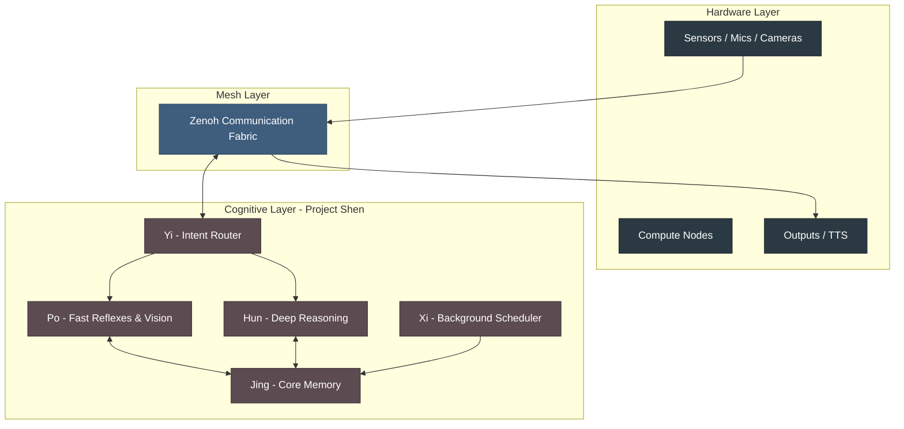
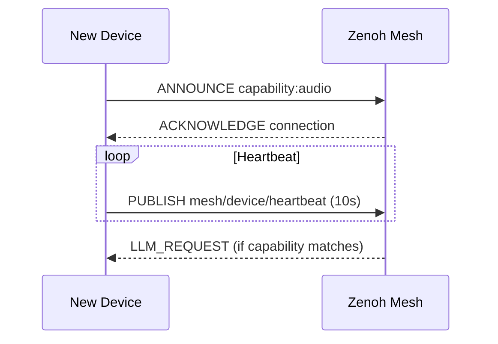
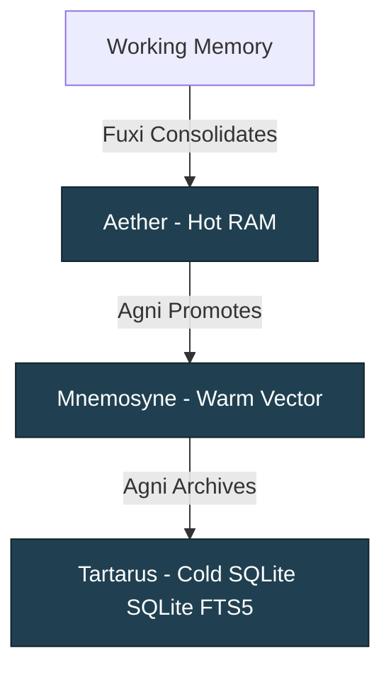

# 🏛️ System Architecture: Velvet Nadir

> Detailed technical architecture for the Velvet Nadir decentralized agentic computing system

> [!NOTE]
> **Implementation Status (March 2026):** Core architecture is ~85% implemented in `sw/velvet/`. The cognitive layer (Project Shen), background task system (Xi), and tiered memory are active. See [PROGRESS.md](PROGRESS.md) for detailed module status.

---

## 📐 Architecture Overview

---

## 🔌 Device Mesh Layer

The foundation that enables distributed operation across all devices, powered by **Zenoh**.

### Device Registration Protocol

**Mesh Capabilities:**
- No central broker (Zenoh is Peer-to-Peer)
- Devices publish capabilities (`audio`, `vision`, `llm`, `storage`)
- Real-time stream topics (`audio/wake`, `audio/transcript`)

---

## 🧠 Cognitive Architecture (Project Shen)

The intelligent core is modeled after traditional Chinese cognitive taxonomy.

### 1. Yi (意) - Intent Router
The dispatcher. It intercepts inbound sensory events (like a wake-word transcript) and routes them:
- To **Po** for fast, immediate reflexes.
- To **Hun** for complex LLM reasoning.

### 2. Po (魄) - Corporeal Soul
Handles rapid, instinctive responses without invoking the LLM.
- **Regex Reflexes:** Hardcoded safety and utility commands (e.g., "stop", "abort").
- **Learned Reflexes:** Po caches frequent tasks to bypass LLM latency (JSON persisted).
- **Vision:** Runs early-stage video monitoring via `VisionMonitor`.

### 3. Hun (魂) - Ethereal Soul
The deep reasoning center. 
- Receives complex requests from Yi.
- Accesses **Jing** context to understand intent.
- Executes multi-step agentic tool plans.

### 4. Jing (精) - Essence / Memory
See **Memory Architecture** below. Tiered persistent state manager.

### 5. Xi (息) - Breath / Background Processing
Runs Cognitive Maintenance (BreathTasks) between conversations to keep resources fresh over time.

---

## 💾 Memory Architecture

Velvet Nadir splits memory into three distinct thermal tiers, managed by **Jing** (powered internally by `PowerMem` running fully locally).

### 1. Aether (Hot)
- Storage: RAM Cache
- Content: Immediate session context, rapid recall data.
- Speed: < 5ms.

### 2. Mnemosyne (Warm)
- Storage: Local Vector DB (SentenceTransformers).
- Content: Relevant past interactions, semantic similarity search.
- Speed: < 50ms.

### 3. Tartarus (Cold)
- Storage: SQLite FTS5.
- Content: Full dialogue logs, archived transcripts, deep history.
- Speed: < 100ms.

---

## 🔄 The Xi Scheduler & Breath Tasks

When the primary gateway goes idle, the system automatically runs the `Xi` scheduler, running tasks in order of priority:

1. **Fuxi (priority 3)**: Reads recent transcripts, writes embeddings into Jing, detects patterns to build new Po reflexes.
2. **Agni (priority 5)**: Memory purification. Runs background GC, archiving old Aether state into Tartarus, promoting important Mnemosyne items.
3. **Inari (priority 7)**: Rebuilds internal caches like Model Affinities and Trust metrics.
4. **DeviceWatchdog (priority 8)**: Scans mesh heartbeats to upgrade trusted devices or downgrade missing ones.
5. **Saraswati (priority 9)**: The automated skill creator (observes needs, generates Python AST, validates, hot-loads into `@skill` registry).

---

## 🔐 Dual Security & Privacy Model

Velvet Nadir enforces a **Dual Perimeter**:

### 1. Network Boundary (Mesh vs. WAN)
No raw conversational data, audio, or visual state leaves the local Zenoh mesh without explicit `PrivacyGuard` exceptions. 

### 2. Trust Boundary (Trusted vs. Untrusted)
Within the mesh, nodes are labeled by the `TrustEngine`. 
- **Trusted Compute:** Fully capable of reading context, routing requests, handling LLM workflows.
- **Untrusted Compute:** Capable of fulfilling task commands (like a smart plug receiving a toggle signal) but blinded to the overall rationale and user context.

---

*This architecture guarantees complete privacy through local execution while enabling infinite extensibility through Zenoh-based distributed plugins and agents.*
