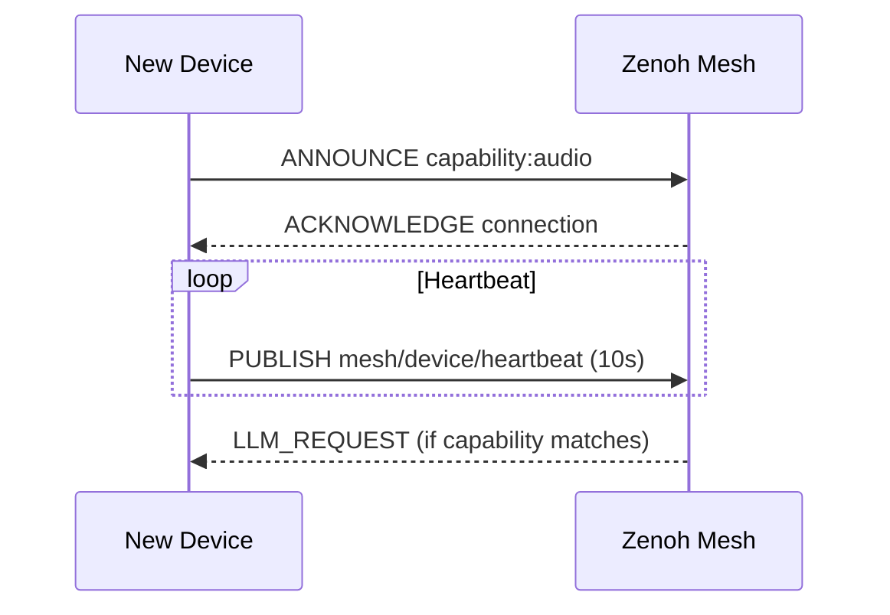
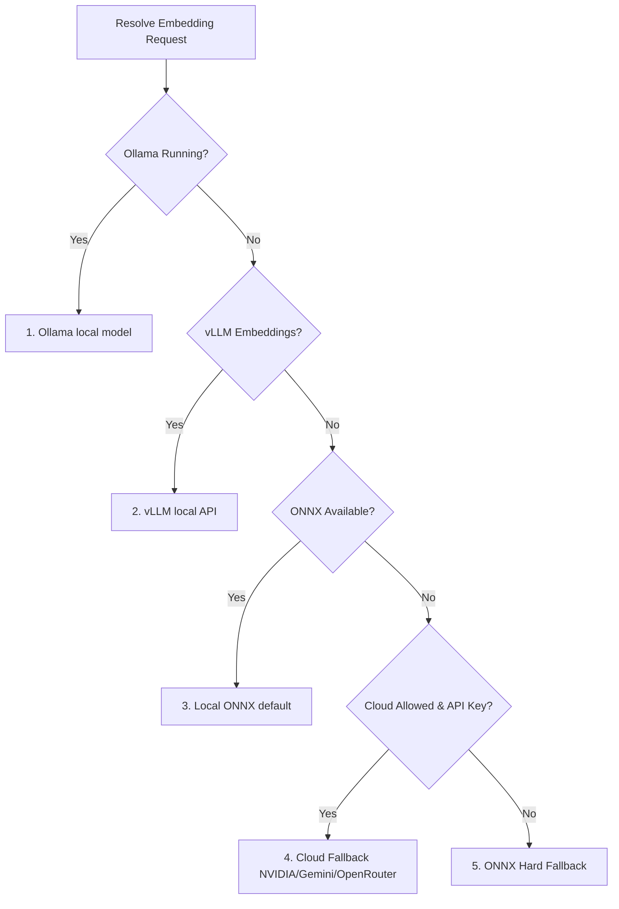

# 🏛️ System Architecture: Velvet Nadir

> Detailed technical architecture for the Velvet Nadir decentralized agentic computing system

> [!NOTE]
> **Implementation Status (June 2026):** Sprint 16 is complete. The cognitive layer (Project Shen), background task system (Xi), resilient self-healing embedding pipeline, and the Universal Cloud LLM Adapter are fully operational. See [PROGRESS.md](PROGRESS.md) for detailed module status.

---

## 📐 Architecture Overview

```mermaid
graph TD
    classDef hardware fill:#2B3A42,stroke:#1A252C,color:#fff;
    classDef mesh fill:#3F5D7D,stroke:#2C4158,color:#fff;
    classDef shen fill:#5C4B51,stroke:#3E3337,color:#fff;
    classDef cloud fill:#7D5C3F,stroke:#58412C,color:#fff;
    
    subgraph Mesh Layer
        M[Zenoh Communication Fabric]:::mesh
    end

    subgraph Hardware Layer
        S[Sensors / Mics / Cameras]:::hardware
        C[Compute Nodes]:::hardware
        O[Outputs / TTS]:::hardware
    end
    
    subgraph Cognitive Layer - Project Shen
        YI[Yi - Intent Router]:::shen
        PO[Po - Fast Reflexes & Vision]:::shen
        HUN[Hun - Deep Reasoning]:::shen
        JING[Jing - Core Memory]:::shen
        XI[Xi - Background Scheduler]:::shen
    end

    subgraph Cloud Layer (Opt-in Gate)
        UCA[Universal Cloud LLM Adapter]:::cloud
    end

    S --> M
    M <--> YI
    YI --> PO
    YI --> HUN
    PO <--> JING
    HUN <--> JING
    XI --> JING
    M --> O
    HUN <--> UCA
```

---

## 🔌 Device Mesh Layer

The foundation that enables distributed operation across all devices, powered by **Zenoh**.

### Device Registration Protocol



**Mesh Capabilities:**
- No central broker (Zenoh is Peer-to-Peer)
- Devices publish capabilities (`audio`, `vision`, `llm`, `storage`)
- Real-time stream topics (`audio/wake`, `audio/transcript`)

---

## 🧠 Cognitive Architecture (Project Shen)

The intelligent core is modeled after traditional Chinese cognitive taxonomy.

### 1. Yi (意) - Intent Router
The dispatcher. It intercepts inbound sensory events (like a wake-word transcript) and routes them:
- To **Po** for fast, immediate reflexes.
- To **Hun** for complex LLM reasoning.

### 2. Po (魄) - Corporeal Soul
Handles rapid, instinctive responses without invoking the LLM.
- **Regex Reflexes:** Hardcoded safety and utility commands (e.g., "stop", "abort").
- **Learned Reflexes:** Po caches frequent tasks to bypass LLM latency (JSON persisted).
- **Vision:** Runs early-stage video monitoring via `VisionMonitor` integrated with the `XiangEngine` for biometric identification.

### 3. Hun (魂) - Ethereal Soul
The deep reasoning center. 
- Receives complex requests from Yi.
- Accesses **Jing** context to understand intent.
- Executes multi-step agentic tool plans, utilizing either local models or the secure `UniversalCloudLLMAdapter`.

### 4. Jing (精) - Essence / Memory
See **Memory Architecture** below. Tiered persistent state manager.

### 5. Xi (息) - Breath / Background Processing
Runs Cognitive Maintenance (BreathTasks) between conversations to keep resources fresh over time.

---

## 💾 Memory Architecture

Velvet Nadir splits memory into three distinct thermal tiers, managed by **Jing** (powered internally by `PowerMem`).


### Tiered Recall
- **Aether** (Hot) — Storage: RAM Cache, recall speed < 5ms.
- **Mnemosyne** (Warm) — Storage: Local Vector DB (SentenceTransformers), recall speed < 50ms.
- **Tartarus** (Cold) — Storage: SQLite FTS5 database, recall speed < 100ms.

### Resilient Embedding Pipeline
To guarantee local-first privacy and reliability, the memory system utilizes a self-healing embedding waterfall when indexing and retrieving:



---

## 🔄 The Xi Scheduler & Breath Tasks

When the primary gateway goes idle, the system automatically runs the `Xi` scheduler, running tasks in order of priority:

1. **Fuxi (priority 3)**: Reads recent transcripts, writes embeddings into Jing, and teaches Po reflexes.
2. **Agni (priority 5)**: Memory purification. Runs background GC, archiving old Aether state into Tartarus, and promoting Mnemosyne items.
3. **Inari (priority 7)**: Rebuilds internal caches like Model Affinities and Trust metrics.
4. **DeviceWatchdog (priority 8)**: Scans mesh heartbeats to suggest trust promotions for reliable devices.
5. **Saraswati (priority 9)**: The automated skill creator (observes needs, generates Python AST, validates). Emits approval requests to gateway and Display UI.
6. **SkillApprovalTask (priority 10)**: Checks for pending skills during idle periods and proactively prompts the user for verbal/chat approval.

---

## 🔐 Dual Security & Privacy Model

Velvet Nadir enforces a **Dual Perimeter**:

### 1. Network Boundary (Mesh vs. WAN)
No raw conversational data, audio, or visual state leaves the local Zenoh mesh without explicit `PrivacyGuard` exceptions. Outbound LLM requests via `UniversalCloudLLMAdapter` are protected by a unified security gate (`allow_cloud_adapters`).

### 2. Trust Boundary (Trusted vs. Untrusted)
Within the mesh, nodes are labeled by the `TrustEngine`. 
- **Trusted Compute:** Fully capable of reading context, routing requests, handling LLM workflows.
- **Untrusted Compute:** Capable of fulfilling task commands (like a smart plug receiving a toggle signal) but blinded to the overall rationale and user context.

---

*This architecture guarantees complete privacy through local execution while enabling infinite extensibility through Zenoh-based distributed plugins and agents.*
